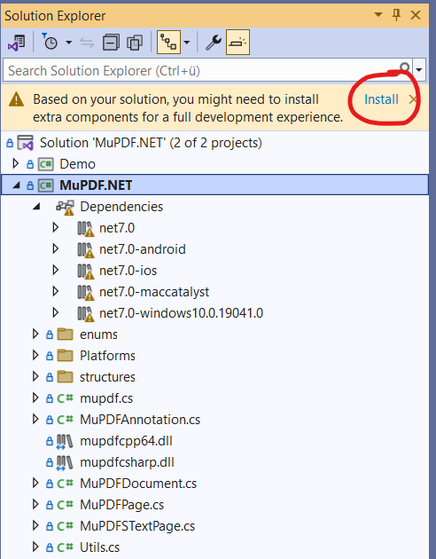

# MuPDF.NET

## About
MuPDF.NET adds C# bindings and abstractions to MuPDF, a lightweight PDF, XPS, and eBook viewer, renderer, and toolkit. Both MuPDF.NET and MuPDF are maintained and developed by Artifex Software, Inc.

## Prerequisites

While being portable to other platforms, this documentation is targeted to the Windows operating system and Visual Studio only.

- Visual Studio Community version 2019 or version 2022
- .Net v7 or later

## Installation

- Clone this repository.

- Expand folder `MuPDF.NET` and double-click on file `MuPDF.NET.sln`. This will start your Visual Studio application.

- Select `Release` and `x64` and select `Build|Solution`. Look at the window "Solution Explorer". If you see warnings like in this picture, click on "Install" as indicated to install any missing components.

- Again select `Build|Solution` and make sure the generation is successful.

- Folder `MuPDF.NET` will now contain some DLL files of which you need `mupdfcpp64.dll` and `mupdfcsharp.dll` for all your future mupdf.net applications. DLL `mupdfcpp64.dll` contains the C library MuPDF wrapped with a C++ binding, and `mupdfcsharp.dll` contains the C# bindings for MuPDF.

- Your system administration may determine to put these DLLs in a system folder or provide access to it via a `path` environment variable. If neither of this is the case, both files must be present in the project `bin` folder of your applications.

## Creating a MuPDF.NET Application

- Create a C# application using the same Visual Studio version that created above system DLLs.

- Download and add MuPDF.NET package from Nuget. Refer to it via instruction `using MuPDF.NET;` in your C# source.

- Code your program and build it using the VS menu items `Build|Solution`. If the system DLLs are not globally accessible as mentioned above, copy `mupdfcpp64.dll` and `mupdfcsharp.dll` to your application's `bin` folder.

- The generated executable of your app is the `.exe` file in the `bin` folder.

## License and Copyright
MuPDF.NET is available under open-source AGPL and commercial license agreements. If you determine you cannot meet the requirements of the AGPL, please contact Artifex for more information regarding a commercial license.
